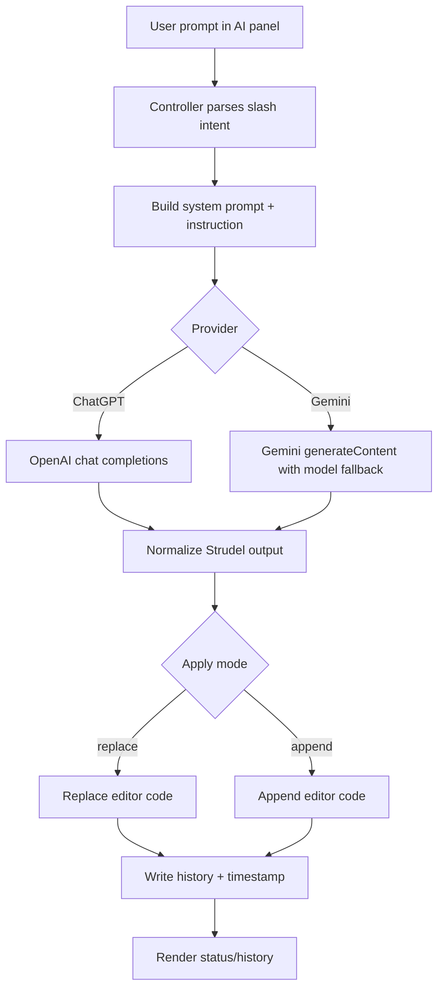

# AI Agents Documentation

This document explains the AI agent architecture used in Strudel Visulas.

## Overview

The app uses a focused agent-like pipeline for music code generation:

1. Parse user intent from prompt text and slash commands.
2. Build a strict Strudel-oriented system prompt and instruction payload.
3. Call selected provider API (OpenAI Chat Completions or Google Gemini).
4. Normalize model output to reduce common Strudel runtime issues.
5. Apply generated code to the editor (replace or append).
6. Persist state/history and surface errors in the UI.

Core files:

- `src/ai/musicCreationSkill.ts`
- `src/hooks/useAiMusicComposer.ts`
- `src/hooks/useAudioVisualizerController.ts`
- `src/components/audio/AiComposerPanel.tsx`
- `src/components/settings/AiComposerSettingsSection.tsx`

## Agent Responsibilities

### 1) Skill prompt builder (`src/ai/musicCreationSkill.ts`)

Provides the domain-specific prompt engineering layer:

- Defines supported intents: `new`, `refine`, `variation`.
- Exposes reusable prompt presets via `MUSIC_CHAT_PROMPT_PRESETS`.
- Builds the system prompt with strict output constraints:
  - Strudel DSL only
  - no markdown or prose
  - executable pattern output
- Adds style and safety constraints for Strudel token usage.
- Creates per-request instruction payload with:
  - intent rules
  - user prompt
  - arrangement targets
  - adaptive hints inferred from genre keywords
  - current editor code context

Important exports:

- `getMusicCreationSkillSystemPrompt()`
- `buildMusicCreationSkillInstruction(...)`

### 2) Provider execution + state (`src/hooks/useAiMusicComposer.ts`)

Handles runtime generation and persistence:

- Provider options: `chatgpt | gemini`
- Apply modes: `replace | append`
- Intents: `new | refine | variation`
- API key handling and optional local persistence
- Generation history (success and failure entries)
- Provider-specific HTTP requests:
  - OpenAI: `POST https://api.openai.com/v1/chat/completions`
  - Gemini: `POST https://generativelanguage.googleapis.com/v1beta/models/{model}:generateContent`

Gemini fallback models are tried in order:

- `gemini-2.5-flash`
- `gemini-2.0-flash`
- `gemini-1.5-flash`

#### Output normalization

The hook normalizes model output before applying it:

- Converts note-name misuse in `n("...")` to `note("...")` when needed.
- Removes comma-octave shorthand in note/chord/scale strings.
- Replaces unknown `sub` sample token in `sound(...)` patterns with `bd`.

This reduces common playback/runtime failures.

#### Friendly error mapping

Transforms raw provider errors into clearer UI messages for:

- invalid/expired keys (`401` / `403`)
- rate limits (`429`)
- OpenAI quota exhaustion
- Gemini model-not-found fallback scenarios

## Intent Parsing and Apply Behavior

Intent parsing happens in `src/hooks/useAudioVisualizerController.ts` via `parseComposerSlashCommand(...)`.

Supported slash commands:

- `/new ...` -> `new`
- `/rework ...` -> `refine`
- `/variation ...` -> `variation`

If no slash command is used, the UI action intent is used as fallback.

Generation apply logic:

- `replace`: editor code is replaced with generated output.
- `append`: generated output is appended to existing editor code with spacing.

## UI Integration

### Composer panel (`src/components/audio/AiComposerPanel.tsx`)

Features:

- Prompt textarea with Enter-to-generate behavior.
- Prompt preset chips from `MUSIC_CHAT_PROMPT_PRESETS`.
- Status/error line with last update time.
- Generation history modal with prompt reuse and clear history actions.

### Settings section (`src/components/settings/AiComposerSettingsSection.tsx`)

Features:

- Enable/disable AI Composer.
- Provider selection.
- Apply mode selection.
- API key input with show/hide and clear.
- Optional "remember key locally" toggle.

## Local Storage Keys

Defined in `src/hooks/useAiMusicComposer.ts`:

- `strudel:ai-composer:enabled:v1`
- `strudel:ai-composer:provider:v1`
- `strudel:ai-composer:prompt:v1`
- `strudel:ai-composer:apply-mode:v1`
- `strudel:ai-composer:remember-key:v1`
- `strudel:ai-composer:api-key:v1`
- `strudel:ai-composer:history:v1`

History is capped to 40 entries and includes provider, intent, prompt, output, and error fields.

## Data Flow

## Extending the Agent System

### Add a new provider

1. Extend `AiProvider` union type in `src/hooks/useAiMusicComposer.ts`.
2. Add provider persistence parsing in `readProvider(...)`.
3. Implement request function similar to `requestChatGptCode(...)`.
4. Extend `generate(...)` branch selection.
5. Update friendly error mapping in `toFriendlyProviderError(...)`.
6. Add UI option in `src/components/settings/AiComposerSettingsSection.tsx`.

### Add a new intent

1. Extend intent unions in `src/ai/musicCreationSkill.ts` and `src/hooks/useAiMusicComposer.ts`.
2. Add intent rule text in `INTENT_RULES`.
3. Update slash parser in `parseComposerSlashCommand(...)`.
4. Ensure history validation accepts the new intent.
5. Add UI trigger if needed.

## Operational Notes

- Generation and API calls run on the client.
- API keys are never required server-side in this implementation.
- If AI Composer is disabled, generation is blocked and UI error state is reset.
- Errors are captured both in UI state and history for traceability.
